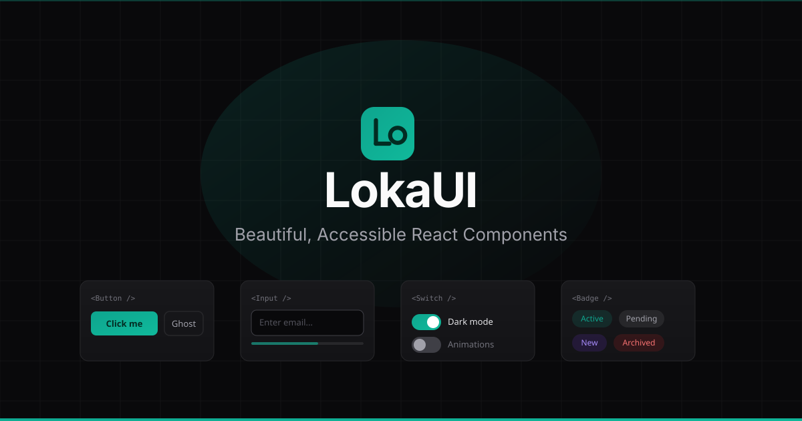

<p align="center">
  
</p>

<h1 align="center">LokaUI</h1>

<p align="center">
  Beautiful, accessible, and fully customizable UI components.<br />
  Copy & paste into your project. No dependency lock-in.
</p>

<p align="center">
  <a href="https://lokaui.dev">Website</a> ·
  <a href="https://lokaui.dev/docs/getting-started">Documentation</a> ·
  <a href="https://lokaui.dev/foundations/button">Components</a>
</p>

---

## Why LokaUI?

- **Copy & paste** — No npm package to install. Copy the source code and own it.
- **Multi-variant** — Each component ships in 4 variants: JS-CSS, JS-TW, TS-CSS, TS-TW.
- **Multi-platform** — React today, with Laravel (Blade) and React Native coming soon.
- **Accessible** — Built on Radix UI primitives with full ARIA support.
- **Themeable** — Dark and light modes with CSS custom property tokens.
- **CLI install** — Or use `npx shadcn@latest add @lokaui/button` for quick setup.

## Quick Start

```bash
# Install a component via CLI
npx shadcn@latest add @lokaui/button
```

Or browse [lokaui.dev](https://lokaui.dev), pick a component, choose your variant, and copy the code.

## Components (24)

| Category | Components |
|----------|-----------|
| **Foundations** | Button, Input, Badge, Toggle |
| **Overlays** | Dialog, Drawer, Tooltip, Popover |
| **Data Display** | Table, Card, Avatar, Progress |
| **Navigation** | Tabs, Breadcrumb, Sidebar, Pagination |
| **Forms** | Select, Checkbox, Radio, Textarea |
| **Feedback** | Toast, Alert, Skeleton, Spinner |

## Variants

Every component is available in multiple variants:

| Platform | Variants | Status |
|----------|----------|--------|
| React | JS-CSS, JS-TW, TS-CSS, TS-TW | Available |
| Laravel | HTML-TW | Button only |
| React Native | RN-TW, RN-StyleSheet | Button only |

## Development

```bash
# Install dependencies
yarn install

# Start dev server
yarn dev

# Build for production
yarn build

# Preview production build
yarn preview
```

## Tech Stack

- **React 19** + **Vite 6**
- **Tailwind CSS 4** with CSS custom property tokens
- **Radix UI** for accessible primitives
- **Shiki** for syntax highlighting
- **React Router v6** for navigation
- **GeistPixel** font for headings

## Project Structure

```
src/
├── components/       # UI components (Header, Sidebar, code display)
├── content/          # Component source code (all variants)
├── pages/            # Route pages (Landing, Category, Docs)
├── previews/         # Live preview components
├── constants/        # Categories, component registry
├── hooks/            # Custom React hooks
└── utils/            # Utilities (fuzzy search, code generation)

scripts/
├── generateSitemap.js    # Build-time sitemap generation
├── generateLlmsText.js   # AI discoverability
└── generateComponent.js  # Scaffold new components
```

## Contributing

We welcome contributions! Here's how:

1. Fork the repository
2. Create a feature branch (`git checkout -b feat/my-feature`)
3. Make your changes
4. Run `yarn build` to verify
5. Commit and push
6. Open a Pull Request

## License

MIT License. See [LICENSE](LICENSE) for details.
